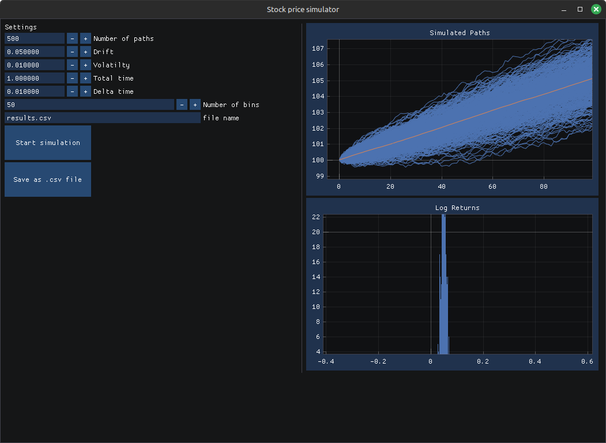

## System Dependencies
- libglfw3
- opengl3
- cmake (minimum version 3.22.1)

## Build the GUI

./build.sh Debug stock-price-simulator-gui
./build.sh Release stock-price-simulator-gui

## Build the cli

./build.sh Debug stock-price-simulator-cli
./build.sh Release stock-price-simulator-cli

### Usage

```
./build/release/stock-price-simulator n_paths=3 \
        drift=0.06 \
        volatility=0.04 \
        initial_value=100 \
        delta_t=0.005 \
        total_time=1.5 \
        process_type=brownian \
        output_file_name=new_results.csv
```